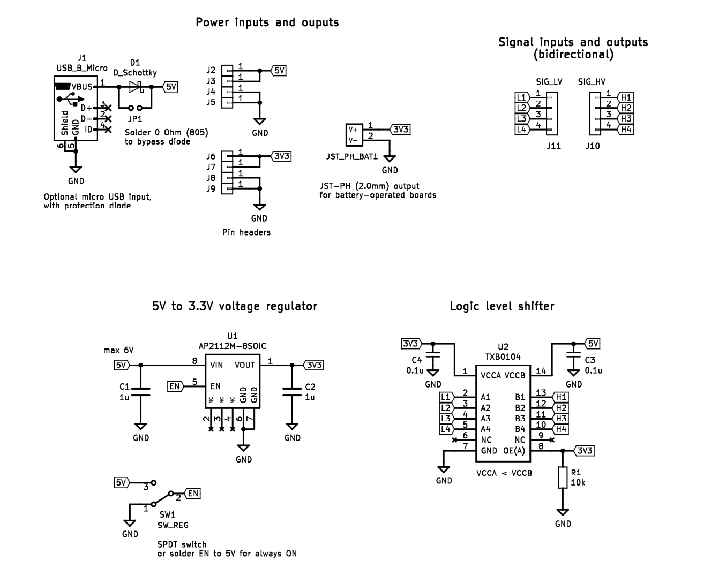
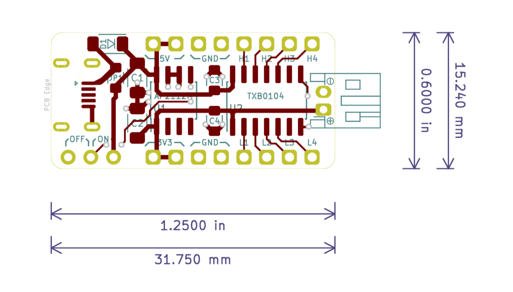
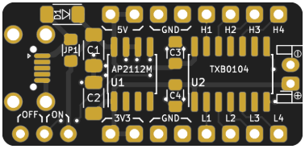
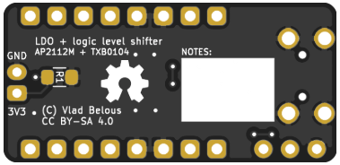

# AP2112M 3.3V-regulator with TXB0104 logic level shifter

Simple module for AP2112M 3.3V regulator (5V -> 3.3V), combined with TXB0104-based logic level shifter.

AP2112M is 8-SOIC (3.90mm width) and TXB0104 is 14-SOIC (3.90mm width).

Minimal components include 4 capacitors (2 x 1uF in 1206, and 2 x 0.1uF in 805), and one pull-down resistor (in 805).

Optional:
* ON/OFF SPDT switch (if not placed, solder a wire between EN and 5V, i.e. between pins under "ON" text)
* Micro USB (type B) connector. Use 4-leg footprint (available on various different sites)
* If Micro USB is used, place either D1 (for extra safety), or solder JP1 jumper (e.g. 0R in 805)
* JST PH (2.0mm) side conentor - may be useful for powering boards with such battery connector.

A version of this PCB (with round holes for micro USB) can be [ordered on PCBs.io](https://PCBs.io/share/rb7jV).

Designed with [KiCad 5](www.kicad-pcb.org).

## Schematic:

## Layout:

## Render (PCBs.io):

